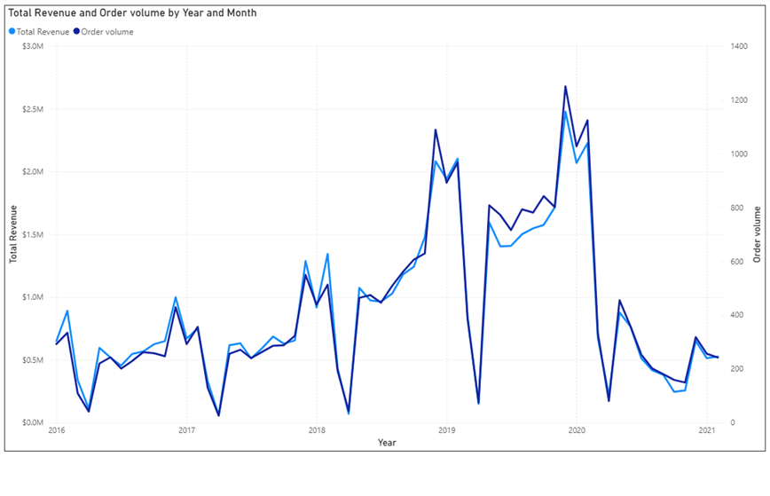

# Global Electronics Retailer 

## Data Overview

The Objective: Analyze historical transaction data to identify trends, optimize channel performance, and pinpoint customer retention risks.


The Dataset: Maven Analytics Global Electronics database spanning five core tables: Customers, Stores, Sales, Products, and Exchange Rates.


The Scope: Analysis of 62,885 total records, evaluating sales volume, channel attribution, and cohort-based demographic behaviors.


## Data Cleaning

Cleans the 5-table Global Electronics Retailer dataset (`Customers`,
`Exchange_Rates`, `Products`, `Sales`, `Stores`) and produces a data quality
report.

## Setup

```bash
git clone <your-repo-url>
cd <repo-name>
pip install -r requirements.txt
```

Drop the raw CSVs into `data/`:

```
data/
├── Customers.csv
├── Exchange_Rates.csv
├── Products.csv
├── Sales.csv
└── Stores.csv
```

## Usage

```bash
python clean_data.py
# or with custom paths:
python clean_data.py --input-dir path/to/raw --output-dir path/to/clean
```

Cleaned CSVs and `data_quality_report.md` land in `output/` (gitignored by
default — remove it from `.gitignore` if you want to commit example output).

## Issues found and fixed

| File | Issue | Fix |
|---|---|---|
| Customers.csv | Latin-1 encoded, not UTF-8 | re-encoded to UTF-8 |
| Customers.csv | `Zip Code` lost leading zeros (836 rows: AU, DE, FR, IT, US) | re-padded per country's standard length |
| Customers.csv | `City` mixes ALL CAPS / Title Case | standardized to Title Case |
| Customers.csv | UK `State Code` just duplicates the full `State` name — not a real abbreviation | flagged, left as-is (no authoritative code available) |
| Customers.csv | `State Code` missing for 10 rows (Napoli, Italy) | left blank — no source value to fill from |
| Products.csv | `Unit Cost USD` / `Unit Price USD` stored as text (`"$1,060.22 "`) | converted to numeric floats |
| Sales.csv | `Delivery Date` missing for ~79% of rows | left blank — means "not yet delivered," not an error |
| Stores.csv | `Square Meters` missing for the Online store | left blank — no physical footprint |

Checked and clean already: no duplicate rows or duplicate keys in any file;
every foreign key in `Sales.csv` (CustomerKey, StoreKey, ProductKey) matches
its parent table with zero orphans; all dates parse with no delivery-before-
order cases; currency codes match 1:1 between `Sales.csv` and
`Exchange_Rates.csv`.

## SQL analysis

Once the cleaned CSVs are loaded into a database (tables matching the cleaned file names), these queries answer some common
retail-analytics questions.

### Sales performance, seasonal trend & channel analysis

**Seasonal trend (revenue, profit, orders)**

```sql
SELECT
    YEAR(Order_Date) AS Year,
    MONTH(Order_Date) AS Month,
    SUM(s.Quantity * p.Unit_Price_USD) AS Revenue,
    SUM(s.Quantity * (p.Unit_Price_USD - p.Unit_Cost_USD)) AS Profit,
    COUNT(DISTINCT Order_Number) AS Orders
FROM Sales s
JOIN Products p
    ON s.ProductKey = p.ProductKey
GROUP BY YEAR(Order_Date), MONTH(Order_Date)
ORDER BY Year, Month ASC;
```

Same metrics as above, broken down to the month level to surface
seasonality (e.g. holiday-quarter spikes).

- **Revenue** = quantity × unit price
- **Profit** = quantity × (unit price − unit cost)
- **Orders** = distinct order count (not line items) per year/category



Key findings:
Revenue shows a repeating Q4-peak, Q1-trough pattern — it builds toward a high around each year-end (likely holiday shopping) before dropping sharply in the following January/February, and this cycle repeats across 2016–2020. That said, some of those early-year drops fall to literal $0, which looks more like a data gap than a true seasonal low, so the peak-to-trough shape is probably real but the depth is exaggerated in places.


**Revenue contribution by channel year over year**

```sql
WITH Channel AS (
SELECT ProductKey, Quantity, Order_Number, Order_Date,
CASE WHEN StoreKey = 0 THEN 'Online' ELSE 'Offline' END AS Channel
FROM GBE_Sales    
)

SELECT YEAR(Order_Date) AS Year, Channel,
SUM(c.Quantity*p.Unit_Price_USD) AS Revenue
FROM Channel c
JOIN GBE_Products p 
ON c.ProductKey = p.ProductKey
GROUP BY YEAR(Order_Date), Channel
ORDER BY Year ASC
```


> Assumes a `Channel` table/view (e.g. Online vs. In-Store) that isn't part
> of the base 5 CSVs — worth a line here on how you built it (e.g. derived
> from `Stores.StoreKey = 0` = Online) if you're sharing this repo.

### Customer analysis & segmentation

**Spend by generation**

```sql
WITH gen AS (
    SELECT 
        CustomerKey, 
        CASE 
            WHEN YEAR(Birthday) BETWEEN 1997 AND 2012 THEN 'Gen Z'
            WHEN YEAR(Birthday) BETWEEN 1981 AND 1996 THEN 'Millennials'
            WHEN YEAR(Birthday) BETWEEN 1965 AND 1980 THEN 'Gen X'
            WHEN YEAR(Birthday) BETWEEN 1946 AND 1964 THEN 'Boomers'
            WHEN YEAR(Birthday) >= 2013 THEN 'Gen Alpha'
            ELSE 'Unknown'
        END AS Generation
    FROM Customers
),

customer_metrics AS (
    SELECT
        s.CustomerKey,
        COUNT(DISTINCT s.Order_Number) AS Orders,
        SUM(s.Quantity * p.Unit_Price_USD) AS Total_spending
    FROM Sales s
    JOIN Products p
        ON s.ProductKey = p.ProductKey
    GROUP BY s.CustomerKey
),

day_diff AS (
    SELECT
        c.CustomerKey,
        DATEDIFF(
            DAY,
            MAX(s.Order_Date),
            (SELECT MAX(Order_Date) FROM GBE_Sales)
        ) AS RFM_Recency
    FROM Customers c
    LEFT JOIN Sales s
        ON c.CustomerKey = s.CustomerKey
    GROUP BY c.CustomerKey
)

SELECT 
    g.Generation,
    SUM(cm.Total_spending) AS Total_spending,
    SUM(cm.Orders) AS Orders,
    AVG(dd.RFM_Recency) AS days_since_last_purchase
FROM gen g
JOIN customer_metrics cm
    ON g.CustomerKey = cm.CustomerKey
JOIN day_diff dd
    ON g.CustomerKey = dd.CustomerKey
GROUP BY g.Generation
ORDER BY Total_spending DESC;
```


**Key findings: **
Boomers are the highest-value customer segment, generating $15.45M in spending from 7,433 orders, followed by Gen X and Millennials with around $13.3M each. Gen Z has the lowest spending at $4.51M, but also has the lowest days since last purchase (600 days), suggesting an opportunity to increase engagement and spending within this segment. The Unknown group contributes a significant $9.14M, highlighting the potential value of improving customer demographic data. Overall, purchasing recency is relatively similar across generations, while spending and order volume show much larger differences.

**Cohort analysis**

WITH 
CustomerCohort AS (
    SELECT 
        CustomerKey,
        YEAR(MIN([Order_Date])) AS CohortYear
    FROM Sales
    GROUP BY CustomerKey
),

OrderGaps AS (
    SELECT DISTINCT
        s.CustomerKey,
        c.CohortYear,
        YEAR(s.[Order_Date]) AS OrderYear,
        (YEAR(s.[Order_Date]) - c.CohortYear) AS YearsSinceStart
    FROM Sales s
    JOIN CustomerCohort c ON s.CustomerKey = c.CustomerKey
),

CohortCounts AS (
    SELECT 
        CohortYear,
        YearsSinceStart,
        COUNT(DISTINCT CustomerKey) AS ActiveCustomers
    -- Tạo thêm cột CohortSize (Số khách hàng ở năm 0) bằng Window Function
    -- Hàm này sẽ tìm số lượng ActiveCustomers tại dòng có YearsSinceStart = 0 của cùng một CohortYear
        ,MAX(CASE WHEN YearsSinceStart = 0 THEN COUNT(DISTINCT CustomerKey) END) 
         OVER(PARTITION BY CohortYear) AS CohortSize
    FROM OrderGaps
    GROUP BY CohortYear, YearsSinceStart
)

SELECT 
    CohortYear,
    YearsSinceStart,
    ActiveCustomers,
    CohortSize,
    ROUND((ActiveCustomers * 100.0 / CohortSize), 2) AS [RetentionRate_%]
FROM CohortCounts
ORDER BY CohortYear, YearsSinceStart;


Buckets customers into generational cohorts by birth year and ranks cohorts
by total spend. Customers born before 1946 fall into `Unknown` under this
cutoff scheme.

> Heads up: this `AOV` divides by `COUNT(Order_Number)` (every line item),
> while `Orders` right above it uses `COUNT(DISTINCT Order_Number)`. If you
> want AOV to mean "average per order" — consistent with the channel query
> above — switch the AOV denominator to `COUNT(DISTINCT Order_Number)` too.

## License

MIT (or your choice — update this section).
